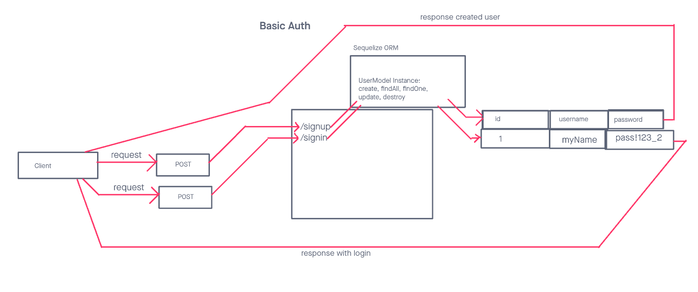

# LAB - 401-D49 Lab-06

## Project: basic-auth

### Author: Lewis Benson

### Problem Domain

Create an API that uses Auth Basic to create a user, and allow a user to login on /signup and /signin

### Links and Resources

- [ci/cd]() (GitHub Actions)
- [server-prod]()

### Setup

#### `.env` requirements (where applicable)

see `.env.sample`

#### How to initialize/run your application (where applicable)

- nodemon

#### Features / Routes

- Feature one: Deploy to Prod

- GET : `/` - specific route to hit
- `/login` : GET - read all items
- `/signup` : POST - create one item

#### Tests

- How do you run tests?
  - npm test
- Any tests of note?
  - handles root path
  - handles invalid paths
  - handles every CRUD function
- Describe any tests that you did not complete, skipped, etc

#### UML

Link to an image of the UML for your application and response to events
